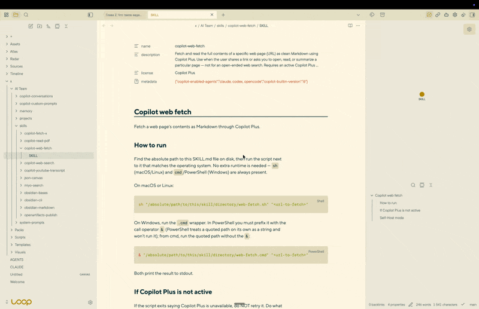

# Sidebar Layouts

Save named arrangements of the left and right sidebars and switch between them with one button.

A layout holds which panel is on top, what is stacked below it and at what heights. Switching moves
the panels that are already open instead of rebuilding them, so each one keeps what it holds - a
scroll position, a selection, text typed into a panel but not yet sent.

Each sidebar has its own layouts and its own active one, so switching on one side leaves the other
side and its live views alone.



Source:
[mrkhachaturov/obsidian-sidebar-layouts](https://github.com/mrkhachaturov/obsidian-sidebar-layouts).

[](https://github.com/mrkhachaturov/obsidian-sidebar-layouts/actions/workflows/check.yml)
[](https://github.com/mrkhachaturov/obsidian-sidebar-layouts/actions/workflows/codeql.yml)
[](https://securityscorecards.dev/viewer/?uri=github.com/mrkhachaturov/obsidian-sidebar-layouts)


<!-- START doctoc generated TOC please keep comment here to allow auto update -->
<!-- DON'T EDIT THIS SECTION, INSTEAD RE-RUN doctoc TO UPDATE -->
## Contents

- [1 Installation](#1-installation)
- [2 Getting started](#2-getting-started)
- [3 What a layout holds](#3-what-a-layout-holds)
- [4 Buttons](#4-buttons)
- [5 Saved and working layouts](#5-saved-and-working-layouts)
- [6 Full width for notes](#6-full-width-for-notes)
- [7 Commands](#7-commands)
- [8 Languages](#8-languages)
- [9 Public API](#9-public-api)
- [10 Quality](#10-quality)
- [11 Privacy](#11-privacy)
- [12 Development](#12-development)
- [13 License](#13-license)

<!-- END doctoc -->

## 1 Installation

Not in Obsidian's community plugin browser yet: a plugin is submitted there after its first release,
and appears once that submission has been reviewed. Until then, either route below installs it.

- **BRAT** - install [BRAT](https://github.com/TfTHacker/obsidian42-brat), then add
  `mrkhachaturov/obsidian-sidebar-layouts` to it. It installs the latest release and follows the
  ones after it.
- **By hand** - download `main.js`, `manifest.json` and `styles.css` from the
  [latest release](https://github.com/mrkhachaturov/obsidian-sidebar-layouts/releases/latest), put
  them in `<vault>/.obsidian/plugins/sidebar-layouts/`, then enable the plugin under Settings →
  Community plugins.

Requires Obsidian 1.13.0 or later.

## 2 Getting started

1. **Arrange a sidebar** the way you want it - open the panels you use, stack them, drag the
   dividers until the heights are right.
2. **Save it** - open the plugin settings, choose **Left sidebar** or **Right sidebar**, then
   **Save current layout**. The page shows the panels it is about to capture before you name it and
   pick an icon.
3. **Switch** - the button appears for that sidebar. Arrange the sidebar differently, save a second
   layout, and the two buttons switch between them.

## 3 What a layout holds

- **The top panel** - the panel revealed in the sidebar's upper group.
- **The panels below** - which panels are stacked underneath, and in what order.
- **Their heights** - kept as a share of the sidebar, so a layout fits whatever width it is given.

The upper group stays in place, which is what lets a live panel survive the switch. Groups below it
may be rebuilt when their arrangement changes, and existing tabs are moved into them rather than
closed. The note you are reading is never touched.

## 4 Buttons

A button belongs to one sidebar and does one of two things: apply a layout, or run any command in
your vault. **Save current layout** and **Add command** create them; **Edit buttons** renames and
reorders them, by dragging or with the keyboard.

- **Button position** - **In the window header** keeps the button visible while the sidebar is
  open, and the native tabs yield space as the sidebar narrows. Left buttons sit at the left edge,
  right buttons beside the right sidebar toggle. **Below panel tabs** puts them in a row of their
  own inside the sidebar, which hides together with it; only that row collects buttons that do not
  fit into **More sidebar buttons**.
- **Show when sidebar is closed** - keeps a window-header button in place after its sidebar is
  closed, so a layout can be reached without opening the sidebar first. Off by default.
- **Show button** - hides the button and leaves its command available.
- **Hide managed tabs** - hides the tab headers of the panels your layouts control, since the
  buttons already do that job. A panel no layout mentions, such as a note dragged into the sidebar,
  keeps its tab.
- **Show tooltips** - shows the button's name on hover.

The last two apply to both sidebars; the rest belong to one button.

## 5 Saved and working layouts

A layout has the arrangement you saved on purpose, and the changes you made to it afterwards.

Move a divider or reveal another panel while a layout is active, and the change is remembered as
that layout's working arrangement once the sidebar settles. Switch away and back, and it is still
there. What you saved stays untouched until you say otherwise:

- **Save changes** - the working arrangement becomes the saved one.
- **Restore saved layout** - discards the changes and brings back the saved arrangement.

Both are on the layout's page in the settings and in the right-click menu of its button. A layout
carrying working changes is marked in the settings list.

Opening a note on top of a layout is not a change to it, and neither is the collapse below.

## 6 Full width for notes

Turn this on for a layout, and while a note is revealed at the top of the sidebar, the panels below
are parked so the note has the whole height. Returning to a panel, or turning the option off,
brings them back at their stored heights.

## 7 Commands

Every layout can register a command of its own, named after the layout - the **Add to the command
palette** toggle on its page. Turning it off removes the command and keeps the button.

Because a layout is an ordinary command, anything that runs commands can switch layouts: a hotkey,
a command launcher, or a rule that reacts to what you open.

| Command ID | Command name |
| --- | --- |
| `sidebar-layouts:apply-right` | Sidebar Layouts: Switch right sidebar layout |
| `sidebar-layouts:apply-left` | Sidebar Layouts: Switch left sidebar layout |
| `sidebar-layouts:save-as-new-right` | Sidebar Layouts: New layout from the right sidebar |
| `sidebar-layouts:save-as-new-left` | Sidebar Layouts: New layout from the left sidebar |
| `sidebar-layouts:apply-<layout id>` | Sidebar Layouts: the layout's own name |

The two switch commands open a picker of the layouts saved for that sidebar.

## 8 Languages

The interface follows the language selected in Obsidian - the settings, the dialogs, command names,
tooltips and the plugin's own messages are all translated, and English stands in wherever a
translation has not caught up. More languages are added over time: one is a file of strings and
needs no other change to the plugin.

Names you type, and labels that come from Obsidian or another plugin, are left as they are.

## 9 Public API

Other plugins can read and apply layouts through `app.plugins.plugins['sidebar-layouts'].api`,
after checking that the plugin is enabled.

| Member | Returns |
| --- | --- |
| `version` | The API version, currently `1` |
| `list(side?)` | Saved layouts - one sidebar's, or all of them with their side |
| `governing(side)` | The id of the layout active in that sidebar |
| `apply(id)` | Applies a layout, on the side it belongs to, and resolves when it is done |
| `capture(side)` | That sidebar's arrangement as it looks now |

The side is `left` or `right`. Layouts are returned as copies, so changing them does not change what
is stored.

## 10 Quality

Every change passes the same gates before it lands: [biome](https://biomejs.dev/),
[ESLint](https://eslint.org/) with the official
[Obsidian plugin](https://github.com/obsidianmd/eslint-plugin),
[TypeScript](https://www.typescriptlang.org/) with `strict` and then some,
[Vitest](https://vitest.dev/) with coverage, [knip](https://knip.dev/) for dead code, and a check
that the CSS classes the plugin ships and the ones its source uses are the same set.

`mise run check` is the whole set, and it runs again before every push. CI runs it on pull requests
and on pushes to `main`, alongside [CodeQL](https://codeql.github.com/) with `security-extended`,
a dependency review that blocks a pull request adding a high-severity advisory, and the
[OpenSSF Scorecard](https://securityscorecards.dev/). Released files carry build provenance, so an
installed copy can be traced back to the run that produced it.

How a release is cut is written in [.github/RELEASING.md](.github/RELEASING.md), and what changed in
each one is in [CHANGELOG.md](CHANGELOG.md).

Automated tests cannot establish how Obsidian lays panels out on a screen, or whether an event
fires in a real vault, so an interface change is also looked at in a running vault before it ships.

## 11 Privacy

No network requests of any kind. No telemetry, no update checks, no downloads.

The plugin never reads or writes your notes. It arranges panels, and keeps its own layouts in
`data.json` inside its plugin folder.

## 12 Development

```sh
mise install && mise run bootstrap   # tools, then dependencies
mise run check                       # every gate
VAULT=/path/to/vault mise run plugin:install
```

Tool versions live in `mise.toml`; npm versions and the resolved dependency tree live in
`package.json` and `package-lock.json`. `bootstrap` runs `npm ci` - run it again after changing
branches when the lockfile changes. Tasks use project-local binaries and never download a missing
compiler or test runner implicitly.

| Task | What it checks or produces |
| --- | --- |
| `mise run lint` | Formatting and generic lint through flint |
| `mise run lint:code` | Obsidian rules and type-aware ESLint |
| `mise run test:types` | TypeScript for source and test fixtures |
| `mise run test:unit` | Unit and DOM tests |
| `mise run test:coverage` | Tests and coverage for all source modules |
| `mise run test:dead` | Unreachable files, unused exports, unresolved imports |
| `mise run test:styles` | Agreement between plugin CSS classes and source |
| `mise run check` | All gates, including the production build |
| `mise run build` | Typecheck and bundle into `main.js` |
| `mise run dev` | Rebuild the development bundle on source changes |
| `mise run fmt` | Apply the fixes supported by flint |

`plugin:install` builds first, then copies `main.js`, `manifest.json` and `styles.css` into that
vault's plugin folder. Settings already in the vault's `data.json` are left alone. Git hooks install
through mise: pre-commit runs hygiene and formatting, commit-msg checks conventional commits, and
pre-push runs `mise run check`.

## 13 License

MIT. See [LICENSE](LICENSE).
